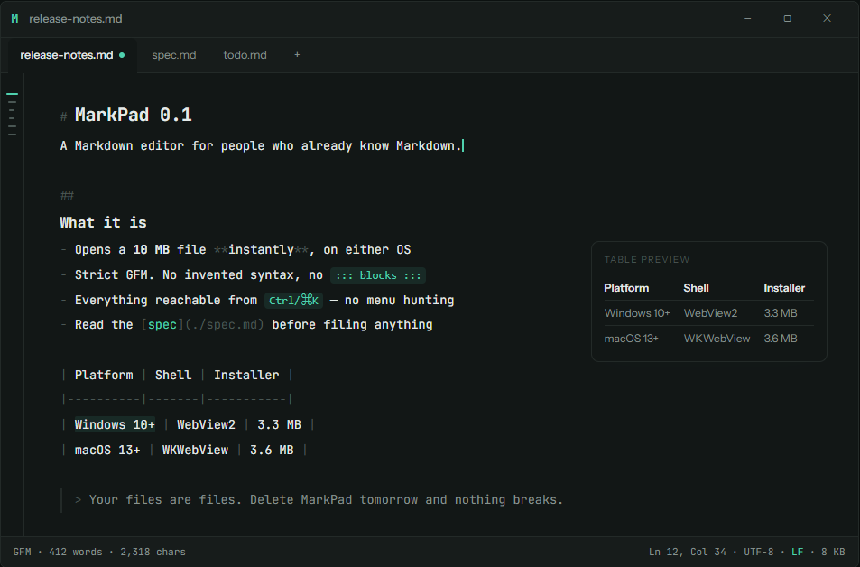

<div align="center">

# MarkPad

**A small, simple Markdown reader and editor for Mac and Windows.**

[](https://github.com/shiphrahx/MarkPad/actions/workflows/ci.yml)
[](https://github.com/shiphrahx/MarkPad/releases/latest)
[](./LICENSE)
[](https://github.com/shiphrahx/MarkPad/commits/main)

[](https://github.com/shiphrahx/MarkPad/releases/latest)
[](https://github.com/shiphrahx/MarkPad/releases/latest)
[](https://tauri.app)


**[Download for macOS or Windows](https://github.com/shiphrahx/MarkPad/releases/latest)**

</div>

---

You double-click a `.md` file, it opens, and it looks like a document rather than raw
syntax. You type. It saves.



## 📥 Install

Grab your file from [the latest release](https://github.com/shiphrahx/MarkPad/releases/latest).

- **macOS** 🍎 two dmgs, one per chip. `aarch64` for Apple silicon, `x64` for Intel.
  Not sure which? Apple menu, then About This Mac. Open the dmg, drag MarkPad into
  Applications.
- **Windows** 🪟 download the `-setup.exe` and run it. Installs for the current user,
  so no admin prompt.

Nothing is code signed, because certificates cost money every year and this is free.
So the first launch needs one extra step:

- **macOS:** right-click the app, choose **Open**, then **Open** again.
- **Windows:** SmartScreen flags an unrecognised publisher. Click **More info**, then
  **Run anyway**.

Stuck on a message about a damaged app or a blocked installer?
[Troubleshooting](https://shiphrahx.github.io/MarkPad/troubleshooting.html) has the
exact wording and the fix.

## ✍️ What it does

- Opens and edits `.md` files, several at a time, in tabs
- Renders as you type, so you read a document instead of a source file
- Source view is one keystroke away when you want it
- `Ctrl+K` / `⌘K` reaches every command, so no hunting through menus
- Tables, LaTeX and Mermaid diagrams preview in a popover
- Exports to HTML or PDF
- Light and dark, following your system setting
- Detects CRLF or LF on open and keeps it on save, which matters when files move
  between Windows, Mac and Linux

## 🚫 What it doesn't do

- No accounts, no sync, no telemetry
- No tags, backlinks or graph view
- No Markdown syntax that only works here
- No bundled Chromium. It uses the WebView already on your machine, which is how the
  installer stays under 4 MB

Your files are ordinary files in ordinary folders. Uninstall MarkPad and they still
open in everything else.

## 🔭 Coming next

- **Linux.** The `.deb` and `.rpm` builds work and the app runs, but it isn't released
  yet. It ships once it's had enough real use on a real desktop to be worth calling a
  release.
- **A portable Windows build.** One `.exe` you can drop on a USB stick or run on a
  machine you're not allowed to install anything on. Nothing to install, nothing left
  behind.

Try it and [open an issue](https://github.com/shiphrahx/MarkPad/issues) when something
annoys you. That's what shapes the next version.

## 🔧 Build it yourself

You'll need [Node 20+](https://nodejs.org), [pnpm](https://pnpm.io) and
[Rust](https://rustup.rs).

```bash
pnpm install
pnpm icons      # generates the app icons, which aren't committed
pnpm tauri dev  # run it
pnpm tauri build  # build an installer
```

Tests and checks:

```bash
pnpm test        # editor tests (vitest)
pnpm typecheck   # tsc, no emit
cd src-tauri && cargo test
```

Tauri v2 for the shell, CodeMirror 6 for the editor, TypeScript and hand-written CSS
for the chrome. No UI framework.

- Hard size and speed budgets live in [`CLAUDE.md`](./CLAUDE.md) and CI enforces them.
  If a change breaks one, the change is wrong and not the budget.
- Design decisions live in [`docs/decisions/`](./docs/decisions). Worth reading before
  suggesting an architectural change.
- Owes a lot to [MarkEdit](https://github.com/MarkEdit-app/MarkEdit), which is excellent
  and macOS only. This is the cross-platform take on the same idea.

## Licence

MIT. See [`LICENSE`](./LICENSE).
